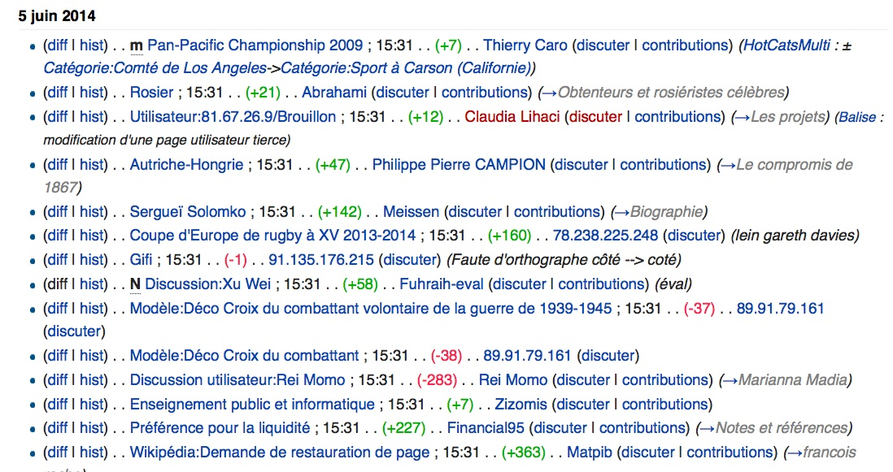

# Peut on mettre en oeuvre la stigmergie ?

# article Principes de mise en oeuvre

Je parlerai d’environnement pour décrire l‘espace de travail qui peut être physique et/ou virtuel. Certains auteurs préfèrent parler de milieu (medium en anglais).

Je parlerai d’agents, à savoir les acteurs qui effectuent un travail ou une action dans le système stigmergique. Notez qu’un agent peut être une personne mais aussi une organisation.

Par organisation j’entends n’importe quel groupe humain structuré que ce soit une entreprise, une association, une institution, ces organisations pouvant elles mêmes fonctionner sur un modèle hiérarchique ou de consensus.

Enfin les noeuds sont les groupes de travail regroupant un nombre plus ou moins grand d’agents autour d’une tache. Un noeud peut se cliver en différentes branches qui, bien que travaillant sur la même tache, utilisent deux approches différentes en parallèle.
Principes de mise en oeuvre

La mise en œuvre de mécanismes de coopération de type stigmergie au sein d’une organisation humaine est une notion récente que nous essayons encore de comprendre.

Dans une démarche de recherche ouverte, je vais ici explorer le sujet en « pensant à voix haute », c’est à dire partager des réflexions, qui ne sont pas complètement abouties, mais qui permettront peut être à d’autres de rebondir (commentez !)

Voici donc certains principes qui me semblent importants pour rendre possible la stigmergie dans une organisation.
Laisser des traces/modifier l’environnement pour rendre visible l’action en cours

Dans sa thèse sur la stigmergie comme modèle pour une collaboration a grande échelle, Mark Elliot cite plusieurs exemples dans le monde physique comme les « desire paths », ces chemins initiés autour de la trace laissé par un promeneur dans l’herbe dont l’action est renforcée par les autres promeneurs percevant cette trace.
"Desire path", le chemin choisi par les promeneurs commence par un trace qui se renforce avec le nombre de passage. Image cc-by-sa-opensourceway

« Desire path », le chemin choisi par les promeneurs commence par une trace qui se renforce avec le nombre de passages. Image cc-by-sa-opensourceway

La coordination se fait de manière indirecte et le sentier se trace tout seul sans concertation entre les individus. Bien souvent le chemin créé spontanément par les usagers est plus adapté au terrain et plus efficace que celui créé par les « experts » (architectes ou autres concepteurs).

En ligne, rendre visible le processus de travail, laisser des traces des actions permet à d’autres contributions de s’agréger spontanément.

L’environnement doit donc pouvoir facilement être modifié et/ou permettre de laisser facilement de traces des actions.

Les traces peuvent être persistantes (perdurent longtemps) ou transitoires (brièvement perceptibles), même si il faut plutôt voir ces deux notions comme faisant parties d’un continuum et qu’il n’y a pas de frontière nette entre les deux.

Les traces persistantes permettent des actions asynchrones, alors que les traces transitoires impliquent obligatoirement des actions synchrones.

La visibilité des traces ou leur capacité à être perçues est influencée par la topologie du milieu: selon que les traces sont visibles ou diffusées de façon large ou restreinte elle pourront être perçues par tous les agents ou seulement une partie d’entre eux .

Pour résumer une chose à retenir:

1er principe: les actions doivent laisser des traces perceptibles.
Ouverture: Transparence et accessibilité des données a priori

Ceci suppose une grande transparence. Si l’information est cachée ou difficilement accessible aucun processus d’auto-organisation spontanée ne pourra se faire.

Au contraire il est même important de réfléchir à comment rendre visible les traces du travail pour faciliter la participation spontanée.

Si les termes d’innovation ouverte ou de co-création sont de plus en plus à la mode, bien souvent il s’agit simplement pour les organisations qui  emploient ces termes de partager quelques données choisies et sur lesquelles elles souhaitent obtenir des retours de leurs utilisateurs.

Ceci est une vision très limitée de l’innovation ouverte et de la co-création.

Dans une vrai démarche d’ouverture type open data, l’intérêt est de voir fleurir des initiatives qu’on n’avait pas forcément prévue au départ (c’est même là tout l’intérêt!).

Cela ne veut pas dire qu’il faut tout ouvrir ou tout montrer, mais en tout cas on ne peut plus rester entre soi derrière ses murs et tout vouloir contrôler, au risque de casser l’émergence de toute auto-organisation stigmergique et de perdre tous les bénéfices potentiels.

Mieux vaut donc une approche de large ouverture a priori et ne protéger/cacher que le strict nécessaire.

2ème principe: large ouverture a priori
Usage de licences libres

Si dans le passé les brevets servaient à soutenir l’innovation, aujourd’hui ils sont trop souvent utilisés de manière abusive et constituent de plus en plus un frein à l’innovation.

Pour bénéficier d’un effet stigmergie il est indispensable de réduire les barrières au passage à l’acte. Si un contenu est verrouillé et qu’une autorisation préalable est nécessaire, toute innovation spontanée sera impossible.

Cette liberté est importante est ce n’est pas un hasard si plusieurs des logiciels les plus importants du web sont des logiciels libres (à titre d’exemple WordPress fait fonctionner plus de 70 millions de sites web, soit presque 20% du web, tandis que Linux sert à faire fonctionner plus d’un tiers des serveurs web, mais aussi plus de la moitié des smartphones).
Utiliser, étudier, distribuer, améliorer: les quatre libertés du logiciel libre

Utiliser, étudier, distribuer, améliorer: les quatre libertés du logiciel libre

 

Notez bien que les « vraies » licences libres autorisent toute réutilisation et modification y compris commerciale. En effet, une licence « semi-libre » qui restreint l’usage commercial est aussi un grand frein à la valorisation de contenu et qui peut même tuer la vie d’un réseau. A ce sujet, voir:

    Les réseaux qui durent sont sous licence CC BY SA

Enfin pour les innovateurs, que ce soit en des agents en interne (équipes, employés) ou en externe (individus, communautés, autres organisations), l’usage d’une licence libre par les initiateurs du projet représente un engagement moral à ne pas accaparer les résultats du travail au détriment des autres partenaires.

Notez à ce sujet l’exemple de Tesla. Cette entreprise a fait beaucoup de bruit en annonçant ouvrir ses brevets sur ses voitures électriques. L’idée de cette démarche d’innovation ouverte est d’agrandir l’écosystème autour de ces technologies en bénéficiant de contributions extérieures. Sans en avoir le nom, cette approche est proche d’un mode de travail en stigmergie.

Or, Tesla n’utilise pas de licence libres. Elle est certes dans une démarche open source (transparence et ouverture des données), mais pas libre et autorise seulement les usages de « bonne foi » (« good faith »), notion floue qui lui permet à tout moment de reprendre le contrôle sur ses technologies et leurs produits dérivés.

La différence peut sembler subtile, mais elle est essentielle. Dans un cas, l’usage libre, un agent peut bâtir sur l’existant et réutiliser le produit de son travail et même en faire un usage commercial pour lui permettre de vivre plus ou moins durablement de son activité.

Dans l’autre cas « open source », les partenaires sont totalement à la merci de Tesla qui peut décider qui a le droit d’utiliser ses technologies ou pas et ainsi tuer un concurrent à tout moment.

C’est ce qui s’est passé avec Twitter qui avait d’abord ouvert ses données pour bénéficier des innovations de sa communauté d’utilisateurs et de développeurs. Twitter a ainsi récupéré les meilleures idées et racheté les meilleurs startups avant de petit à petit reprendre le contrôle et de restreindre les accès, décimant une grosse partie de l’écosystème de développeurs qui avait pour tant largement contribué à faire son succès.

Si cette approche peut amener des gains à court terme, sur le long terme elle est vouée à l’échec, car les agents échaudés par ce type d’histoires ne travailleront plus sur de tels projets non libres et dans lesquels il ne pourront pas s’investir en toute confiance.

3ème principe: usage de licences libres
Mécanisme de contrôle a posteriori

J’ai parlé précédemment d’ouverture a priori, elle même très liée aux principes de transparence, de licences libres (décrites plus haut) et l’autonomie des agents (décrite plus bas). A ceci s’ajoute la nécessité d’un contrôle a posteriori pour les entreprises ou autres organisations qui ont un but précis à atteindre.

Pour un écosystème comme le monde du logiciel libre ou les Shan Zhai (voir les exemples d’organisation stigmergiques), il n’y a pas de but à atteindre pour l’écosystème lui même et le système peut partir dans toutes les directions.

En revanche pour une entreprise ou une communauté comme Wikipédia, il y a besoin d’un contrôle a posteriori pour garantir une certaine qualité dans le résultat ou une échéance particulière.

Contrairement aux modèles de hiérarchie ou de consensus qui sont tout deux des modèles avec contrôle a priori et autorisation a posteriori, la stigmergie est un modèle avec autorisation a priori et contrôle a posteriori.

Plus de détails dans cet article:

    La coopération ouverte: principes et tentative de définition

4ème principe: mécanisme de contrôle a posteriori
Grand nombre et grande diversité d’agents

Avoir un groupe de grande taille augmente la probabilité d’obtenir une correspondance entre les taches à effectuer et les compétences en présence.

C’est aussi l’idée derrière le concept d’innovation ouverte. Même si une grande organisation possède de nombreux talents en interne, il y a toujours plus de talents à l’extérieur, qu’à l’intérieur de l’organisation.

En fait à notre époque de réseaux, où les clients et usagers ne sont plus simplement consommateurs, mais des contributeurs qui peuvent participer à la conception de produits, de services, à leur promotion et voir même à leur financement, la frontière entre l’intérieur et l’extérieur d’une organisation devient donc de plus en plus poreuse.

Au delà d’un grand nombre d’agents, le plus important est la diversité de ces agents comme autre moyen d’augmenter la probabilité que les taches puissent trouver les compétences nécessaires pour être traités.

Plus le groupe est diversifié, plus il sera riche et plus l’intelligence collective pourra augmenter. C’est ce que l’on observe dans des évènements co-créatifs comme le forum ouvert ou les hackathons.

Comme dans les écosystèmes, la biodiversité est importante: une monoculture est moins productive qu’une polyculture.

Petite note: au delà du nombre et de la diversité des talents, il y a une notion d’interactions. Il ne suffit pas d’empiler les talents, il faut aussi qu’il y ait du lien entre les agents (pensez à la différence entre une foule et une communauté, les liens entre les gens ne sont pas du tout les mêmes).

C’est cette diversité interactive qui fera effectivement la force du système (ce point sera développé dans un autre article).
network-linkedin

diversité: sur cette représentation graphique de mon réseau LinkedIn on voit plusieurs groupes distincts se détacher, correspondant à différents types de réseaux, (recherche en biologie, marketing de la musique, ESS, Angleterre, Inde, …). Un projet au carrefour de plusieurs réseaux très différents à accès à une grande richesse de talents.

Une question lors d’une rencontre en ligne demandait si la stigmergie pouvait être utilisé dans des contextes de handicap. Ceci est un point très intéressant. Dans les organisations classiques, on fait généralement rentrer les individus dans des rôles prédéfinis et dans notre société en général on distingue les gens qui rentrent dans les normes ou pas.

Or, une personne souffrant d’un handicap dans un domaine peut par ailleurs être extrêmement performante dans d’autres domaines, avoir un point de vue et des idées très différentes. En laissant la personne choisir où s’impliquer on se donne la chance de bénéficier de compétences dont on n’avait même pas idée.

Ce qui nous amène a un autre point clé, l’auto allocation des taches, à savoir le fait que les agents choisissent eux mêmes où s’impliquer.

5ème principe: grand nombre et grande diversité des agents
« Open allocation » = autonomie des agents et équipes émergentes

Que ce soit le responsable hiérarchique ou le groupe qui décide, dans les modèles classiques on a tendance à définir des taches et à designer des personnes pour les faire rentrer dans ces taches prédéfinies.

Deux problèmes de cette approche:

    il est impossible pour un individu ou un petit groupe de décideurs de prévoir toute les taches nécessaires ou qui seraient importantes
    pré-définir en amont des taches force ensuite les agents à rentrer dans les cases et à s’adapter à la tache au lieu d’adapter la tache à leur façon de faire

En stigmergie les agents sont libres de choisir où se positionner et sur quelle taches se greffer. Ce libre choix a pour intérêt que chacun va spontanément se positionner là où il connait le mieux le sujet, où il se sent plus adapté, plus en phase avec le projet et où ses compétences seront les plus utiles.

stigmergie schema

 

Dans le forum ouvert, c’est la fameuse « loi des deux pieds », où les personnes sont libres de faire usage de leurs pieds pour se rendre dans un endroit plus productif ou plus intéressant à leurs yeux.

Plusieurs entreprises utilisent déja cette « auto-allocation » (en anglais « open allocation » ou allocation ouverte) où les équipes « émergent » du choix des individus. Sur la notion d’ « open allocation » / autonomie des agents, je vous encourage à lire ces deux articles:

    https://en.wikipedia.org/wiki/Open_allocation
    http://www.forbes.com/sites/quora/2012/11/26/what-is-open-allocation/

Voyez aussi les paragraphes sur Valve et Github, deux entreprises qui utilisent ce mode de fonctionnement dans l’article Coopération stigmergique (1/2): des exemples d’organisations.

6ème principe: auto-allocation des taches
Croissance organique et division en noeuds

Comme le dit Heather Marsh,

    La stigmergie encourage la fragmentation en différents noeuds plutôt que le modèle entrepreneurial traditionnel d’acquisition et d’expansion sans fin. Parce que chaque individu n’est responsable que de son propre travail, et que personne ne peut diriger un groupe de contributeurs, l’expansion signifie plus de travail pour l’individu et une perspective d’auto-limitation.

Il peut donc y avoir croissance et expansion, mais d’une façon très différente des modèles classiques.

Cette fragmentation en « noeuds » ou pôles plus spécialisés permet une croissance plus organique en phase avec les besoins et l’environnement.

Une organisation souhaitant mettre en œuvre la stigmergie ne devrait pas encourager la formation artificielle de grosses structures, mais laisser les mécanismes d’auto-allocation s’auto-réguler pour une croissance « organique » et distribuée qui colle au plus près des besoins du terrain.

Sur l’utilité de petit groupes de travail, notez que Jeff Bezos, patron d’Amazon, pourtant une énorme entreprise, pousse ses équipes à appliquer la « règle des deux pizzas », à savoir qu’une équipe devrait être assez petite pour que deux pizzas suffisent à partager un repas.

Quand un groupe grandit, le nombre d’interactions potentielles entre les participants grandit lui aussi, mais de façon exponentielle ce qui augmente le temps et le cout de communication. Conserver de petit groupes de travail permet d’augmenter la qualité de communication, plutôt que la quantité. (voir The Science Behind Why Jeff Bezos’ 2-Pizza Rule Works).

Quand les individus sont libres de s’organiser, ils ont naturellement tendance à recréer des petits groupes de travail où tout le monde se connait et où l’interaction et la discussion sont faciles.

7ème principe: croissance organique et division en noeuds
Gestion des taches critiques

L’inconvénient de l’auto-allocation est que certaines taches plus pénibles ou rebutantes pourraient rester orphelines. Dans beaucoup de cas c’est un signe que ces taches ne sont pas nécessaires ou ne sont pas le meilleur moyen d’atteindre le but souhaité.

Pour une organisation avec un but ou une échéance précise à atteindre, il peut malgré tout être nécessaire de combiner un fonctionnement en réseau stigmergique avec une organisation classique (hiérarchie pyramidale ou consensus) pour la gestion de certaines taches critiques.

Dans son livre « la coopération nouvelles approches » Jean-Michel Cornu qui a étudié le modèle de coopération des communautés du logiciel libre a bien décrit l’intérêt de gérer les taches critiques tout en sachant maximiser les opportunités.

Même s’il ne parlait pas de stigmergie à proprement parler, ses réflexions sont pertinentes pour la mise œuvre de stigmergie à des fins précises.

A ce sujet, lire: La coopération, nouvelles approches – synthèse mindmap: résumé du livre de référence de Jean-Michel cornu sur les nouveaux modèles coopératifs et de travail en réseau.

8ème principe: gérer les taches critiques
Accepter les projets parallèles (fork/branches)

Un fork ou embranchement est la scission d’un projet (un noeud) en 2 (ou plus) entités distinctes qui évoluent en parallèle. Cette notion vient du monde du logiciel libre.

    Un fork, ou embranchement, est un nouveau logiciel créé à partir du code source d’un logiciel existant. Cela suppose que les droits accordés par les auteurs le permettent : ils doivent autoriser l’utilisation, la modification et la redistribution du code source. C’est pour cette raison que les forks se produisent facilement dans le domaine des logiciels libres.

    Un fork peut être bénéfique pour un projet donné lorsque sa gouvernance actuelle conduit à une impasse, sa reprise par un nouveau groupe pouvant le relancer. Il peut aussi être néfaste en provoquant un éparpillement des ressources.

    https://fr.wikipedia.org/wiki/Fork_%28d%C3%A9veloppement_logiciel%29

En stigmergie les agents sont autonomes et sont donc libres de rejoindre un nœud/projet existant ou d’en créer un nouveau qui leur convient mieux, même si cela veut dire avoir deux branches qui travaillent sur le même sujet en parallèle.

Dans un projet classique, la scission en branches pouvait mettre en péril un projet, avec un risque de dilution des énergies et des ressources.

En stigmergie l’apparition de branches génère de la diversité et de la redondance dont le système peut tirer parti et ce qui pouvait être un problème devient une solution (A ce sujet, voir en fin d’article les liens sur le modèle Git. Celui ci sera décrit dans un prochain article).

WordPress, cité plus haut, est né d’un un fork du logiciel b2/cafelog et a réussi à faire naitre un écosystème est extrêmement riche d’utilisateurs et de développeurs. Il compte aujourd’hui plus de 1600 thèmes (chartes graphiques réutilisables) et plus de 22 000 plugins (modules permettant d’ajouter des fonctionnalités supplémentaires).

Il existe souvent plusieurs plugins pour la même fonction, ce qui a priori pourrait être une inefficacité du système. Pourtant cette diversité est elle aussi source de richesse, l’écosystème offrant à chaque fois plusieurs possibilités pour aborder chaque type de problème, chaque développement parallèle pouvant lui même influencer les autres. Cette diversité permet à chacun de trouver une solution selon ses besoins, ce qui contribue à attirer d’autres utilisateurs et contributeurs, et ainsi agrandir l’écosystème dans une spirale vertueuse.

C’est la même chose dans l’écosystème Linux où plusieurs versions co-existent depuis plusieurs années en parallèle, chacune offrant divers avantages et inconvénients.

Une organisation stigmergique devrait donc prendre en compte et accepter le fait que plusieurs projets a priori « concurrents » puisse avoir le droit de co-exister du moment que des agents choisissent de les porter. Mieux elle devrait essayer de faciliter le développement de telles branches. (des outils et pratiques peuvent faciliter cela, ce qui sera le sujet d’un prochain article).

9ème principe: accepter et faciliter les branches de projets développés en parallèle
Des règles d’interaction simples

Dans les sociétés d’insectes sociaux, la complexité et l’auto-organisation émergent de règles simples de comportement en réponse à un signal présent dans l’environnement (par exemple pour les termites « je fais des boules de boue en ajoutant des phéromones et si je trouve une boule de boue similaire, je pose la mienne à coté »).

En systémique, il a été montré que les comportements émergents du système étaient issus de règles simples qui, combinées avec un grand nombre d’interactions entre agents et d’étapes, finissaient par aboutir à une méta-structure plus complexe.

Dans le travail en grand groupe sur un modèle stigmergique, l’usage de règles simples semble aussi essentiel.

S’il faut apprendre un tas de règlements compliqués, la barrière au passage à l’acte est trop forte et l’implication spontanée ne pourra pas se faire.

De plus avec un grand nombre et une grande diversité d’agents, des règles compliquées nécessiterai de prévoir de nombreux cas de figures et rendrait les choses impossibles. C’est ce qui a tendance à se passer dans les organisations vieillissantes qui ont tendance à se scléroser sous le poids de leur propres règles et à devenir de véritables usines à gaz.

10ème principe: des règles d’interaction simples
Intention commune / Objectifs prépondérants

Dernier principe évoqué, mais peut être l’un des plus important.

Dans sa thèse (Stigmergic Collaboration: A Theoretical Framework for Mass Collaboration; Phd, 2007) Mark Elliot évoque la notion de « Superordinate Goals » que l’on peut traduire par « objectifs prépondérants ».

Un objectif prépondérant est quelque chose d’assez grand et persuasif pour aider les individus et les groupes à surmonter leur différences personnelles afin d’arriver à quelque chose de plus important que ce qu’ils auraient pu faire en restant isolés.

Pour que le groupe avance il est essentiel d’avoir un minimum d’intention commune. Dans les projets collaboratifs de masse, de tels objectifs apparaissent souvent sous forme de mission d’entreprise (« mission statement »), description de projet, instructions, ligne de conduite, qui essayent de communiquer les objectifs et problématiques du groupe.

Les objectifs prépondérant ont aussi tendance à communiquer les valeurs clés, les croyances, les normes du groupe, ce qui a pour effet d’attirer des participants partageant ces valeurs. Mark Elliot indique que les objectifs prépondérants ne devraient pas être sous estimés car ils jouent un rôle crucial dans la formation de l’identité collective, les attentes et les procédures de la communauté.

Lire:

    http://p2pfoundation.net/Superordinate_Goal

11ème principe: intention commune autour d’un objectif prépondérant
L’exemple de Wikipedia comme organisation stigmergique

Dans cette partie, je prends l’exemple de Wikipédia pour montrer de façon pratique comment ces principes sont à l’œuvre dans le fonctionnement de Wikipédia.
Objectif prépondérant

La vision de la Wikimédia foundation est un bel exemple d’objectif prépondérant:

    « Imagine a world in which every single human being can freely share in the sum of all knowledge. That’s our commitment. » — Wikimedia Foundation’s Vision. .

     

    « Imaginez un monde dans lequel chaque être humain peut librement obtenir et partager des connaissances. Ceci est notre engagement. » – Vision de la Wikimedia foundation

    Ceci se fait notamment à travers le projet Wikipédia qui a pour objectif d’offrir un contenu libre, objectif et vérifiable que chacun peut modifier et améliorer, sans nécessité de s’enregistrer. Tous les articles de Wikipédia sont un travail en progression qui peut être modifié et amélioré par tout le monde.

Puissante et inspirante, c’est cette vision partagée qui rassemble tous les bénévoles Wikipédia autour d’un objectif commun.
Règles simples

Wikipédia possède quelques règles simples, mais essentielles qui régissent le projet et sa gouvernance:

Principes fondateurs de Wikipedia

    Pertinence encyclopédique
    Neutralité de point de vue,
    Contenu libre
    Savoir-vivre
    Souplesse des règles

Laisser des traces/modifier l’environnement pour rendre visible l’action en cours

Sur Wikipédia plusieurs signaux appellent les participants à collaborer. Par exemples des bandeaux placés dans les pages indiquent à la communauté les choses à améliorer.
une ébauche d'article sur wikipédia. La taille d'un article est un premier signal pour encourager l'article a être complété par d'autres participants. Le bandeau signalant la qualité d'ébauche et encourageant la participation renforce ce signal.

une ébauche d’article sur wikipédia. La taille d’un article est un premier signal pour encourager l’article a être complété par d’autres participants. Le bandeau signalant la qualité d’ébauche et encourageant la participation renforce ce signal.

Autre exemple de signal plus subtil, un lien vers une page inexistante (ci dessous en rouge). Ce lien qui a été crée par un participant pointe vers une page qui n’existe pas encore.
un lien en rouge signale que la page lié n'existe pas encore. Le fait que le lien ai été placé indique un appel a créer cette nouvelle page et facilite la création de cette nouvelle page

un lien en rouge signale que la page lié n’existe pas encore. Le fait que le lien ait été placé indique un appel à créer cette nouvelle page et facilite la création de cette nouvelle page

En créant ce lien en amont alors que la page n’existe pas encore, le contributeur fait deux choses:

    il lance un appel à créer la page inexistante
    il facilite la création de cette page puisque les autre participants ont simplement à cliquer sur le lien pour commencer à ajouter du contenu dans cette nouvelle page

Cette modification de l’environnement (créer un lien vers une page qui n’existe pas encore) induit donc l’action suivante (créer la page).

Autre exemple, la page des modifications récentes rend visibles les contributions en cours et induit l’action d’autres contributeurs pour corriger, compléter, annuler.
la liste des modifications récentes sur Wikipédia, rend visibles contributions en cours et induits l'action d'autres contributeurs pour corriger, compléter, annuler.

la liste des modifications récentes sur Wikipédia,

 

Notez que certaines des ces traces sont générées de façon automatique par l’architecture du système (changements récents), d’autres activement par les contributeurs (bandeau d’infos), d’autres un peu entre les deux (le lien vers une page vide est crée par un utilisateur, mais le système complète automatiquement en créant un lien qui générera la page correspondante).

Notez aussi que certaines traces sont plutôt transitoires (les changements récents, même s’il restent consultables sont rapidement moins visibles et donc probablement moins consultés après coup) tandis que d’autres perdurent (liens, bandeaux) et permettent donc une collaboration asynchrone (un lien appelant à créer une page peut rester inutilisée pendant des années avant qu’ un nouveau contributeur suive la trace pour compléter le travail entamé précédemment).
Autorisation a priori:

Sur Wikipédia, n’importe qui peut modifier les contenus pour les améliorer et chacun est même encouragé à le faire.

En pratique ce n’est pas toujours si simple et on a souvent critiqué Wikipédia pour le fait que les contributeurs expérimentés, qui connaissent mieux les règles ont plus de pouvoir que les contributeurs qui sont peut être plus experts, mais moins au fait des subtilités de la culture Wikipédia.

Mais si tout n’est pas parfait, globalement chacun peut prendre des initiatives là où il le souhaite. C’est ce qui a permis la croissance phénoménale de Wikipédia.
Ouverture a priori / Transparence:

Sur Wikipédia tout est visible publiquement par défaut: des modifications aux discussions (parfois enflammées) sur le contenu des article, les règles, les budgets, …

wikipedia-discussion

Ceci permet à chacun de s’impliquer, d’apporter suggestions, commentaires, critiques qui enrichissent le projet de l’intelligence collective de la communauté.
Licence libre:

Sur Wikipedia tous les contenus postés doivent être libres de droits et sont eux mêmes places sous licence Creative Commons paternité partage à l’identique.

Ceci permet à chacun de s’impliquer sachant que son travail ne sera pas enclos/accaparé, mais aussi de mutualiser du contenu (photos, documents, sons…) avec d’autres projets eux aussi libres.
Contrôle a posteriori:

Il n’y a pas besoin de demander l’autorisation pour voir ou agir et la correction ou le blocage de vandales se fait a posteriori sur la base de ce qui a été fait.

Ainsi les corrections se font, si besoin, après modification.

De même certaines pages traitant de sujets controversés (religion, politique) sont parfois temporairement verrouillées, le temps de laisser retomber les tensions, certains participants peuvent être temporairement ou indéfiniment bloqués pour leurs actes, mais à chaque fois le contrôle se fait uniquement a posteriori.

wikipedia-historique

Le système d’historique qui enregistre et permet de comparer les différentes versions des pages facilite ce contrôle par la communauté
Gestion des taches critiques

Si certaines taches ne sont pas critiques pour l’encyclopédie (si un article est incomplet, cela ne nuit pas à l’avenir du projet), d’autres en revanche sont essentielles. Si les serveurs qui hébergent le projet tombent en panne ou que le nom de domaine n’est pas renouvelé, cela aura un grave impact sur le projet.

Pour assurer la gestion des taches critiques (collecte des fonds qui servent à payer l’hébergement et d’autres travaux servant au développement de l’encyclopédie) a été mis en place la Wikimedia Foundation, un organisme à but non lucratif.

L’objectif de la Wikimedia Foundation est de « promouvoir la croissance et le développement de projets de diffusion du savoir libre fondés sur le principe du wiki, et d’en distribuer le contenu publiquement et gratuitement ».

Elle ne possède aucun droit éditorial sur les contenus proposés sur le site de Wikipédia mais organise les campagnes de financement et redistribue les dons des utilisateurs pour faire tourner les taches critiques des projets (hébergement des différents projets Wikimedia multilingues, développements informatiques, actions de communication…).
Auto allocation:

Sur Wikipédia,chacun est libre de se positionner sur à peu près n’importe quelle tache.

Que ce soit éditer les très nombreuses pages, ajouter des photos, améliorer le logiciel, faire un don, accueillir les nouveaux ou aider à résoudre les conflits en interne, il existe de nombreuses façon de contribuer spontanément.
Grand nombre et grande diversité d’agents:

Wikipédia n’existe que grâce au dizaines de milliers de contributeurs qui l’éditent, l’entretiennent, la financent. Sans cette masse critique de contributeurs rassemblés autour d’un même objectif prépondérant, le projet n’aurait pas pu devenir ce qu’il est devenu.

Notez que s’il y a une certaine diversité globale (nombreuses langues et cultures), Wikipédia souffre encore d’une disproportion en faveur d’une population de jeunes adultes masculins occidentaux, ce qui explique que les pages sur les jeux vidéos soient très complètes alors que d’autres sujets plus encyclopédiques restent mal traités.

Ceci peut aussi poser parfois problème au niveau de l’intégration des nouveaux ou d’autres groupes culturels qui peuvent se sentir exclus. Accroitre la diversité des contributeurs reste un enjeu pour Wikipédia.
Accepter les branches parallèles

Par rapport à ma grille de principes, celui ci ne semble pas être respecté, puisque que chaque article a une version unique et qu’il n’est pas possible de créer une version parallèle d’un article.

Cela tient au fait que Wikipédia ayant pour mission de fournir une encyclopédie objective/neutre et universelle, une seule version de chaque sujet existe. Ceci peut parfois être un problème ou un sujet complexe ne fait pas consensus et la page doit pourtant offrir une version unique et objective.

Pourtant, on pourrait imaginer une architecture où chaque sujet pourrait avoir différentes pages subjectives qui permettrait au lecteur d’avoir non pas une version unique et « objective » de la vérité, mais plusieurs versions ouvertement subjectives, qui pourraient peindre un tableau plus réaliste de la vérité.

Notez cependant qu’il est courant qu’un même article rédigé dans différentes langues montre des différences et des spécificités liées à la culture, au niveau de connaissance… On peut donc aussi voir les différentes Wikipédias multilingues comme des branches parallèles qui peuvent se nourrir mutuellement. C’est une richesse sous exploité à l’heure actuelle. On pourrait imaginer la mise en place de mécanismes pour tirer parti de cette diversité.
Conclusion

Voici donc en résumé, les onze principes dégagés jusqu’ici.

    1er principe: les actions doivent laisser des traces perceptibles.
    2ème principe: large ouverture a priori
    3ème principe: usage de licences libres
    4ème principe: mécanisme de contrôle a posteriori
    5ème principe: grand nombre et grande diversité des agents
    6ème principe: auto-allocation des taches
    7ème principe: croissance organique et division en nœuds
    8ème principe: gérer les taches critiques
    9ème principe: accepter les branches de projets développés en parallèle
    10ème principe: des règles d’interaction simples
    11ème principe: intention commune autour d’un objectif prépondérant

Il se peut que cette liste ne soit pas complète ou que certains principes nécessitent d’être précisés ou reformulés. Vos commentaires sont donc les bienvenus.

 
Références/ressources complémentaires:

Des liens cités plus haut, d’autres non cités mais intéressants aussi.

La stigmergie: un nouveau modèle de gouvernance collaborative
http://www.lilianricaud.com/travail-en-reseau/la-stigmergie-un-nouvelle-modele-de-gouvernance-collaborative/

Réflexion collective sur la stigmergie grâce à la méthode de la connaissance créatrice
http://www.lilianricaud.com/travail-en-reseau/reflexion-collective-sur-la-stigmergie-grace-a-la-methode-de-la-connaissance-creatrice/

Liens collectés lors de ma veille sur la stigmergie
https://www.diigo.com/search?adSScope=my&what=stigmergy&snapshot=no

Les passagers clandestins : difficulté ou opportunité ?
http://ic.fing.org/news/les-passagers-clandestins-difficulte-ou-opportunite

Stigmergic Collaboration: The Evolution of Group Work
http://journal.media-culture.org.au/0605/03-elliott.php

Stigmergic Collaboration: A Theoretical Framework for Mass Collaboration (Phd, 2007)
http://mark-elliott.net/blog/?page_id=24

Stigmergy as a Universal Coordination Mechanism: components, varieties and applications (2015, à paraitre)

Note: pour ceux qui veulent en savoir plus sur les mécanismes théoriques, Francis Heylighen montre dans un article de recherche très pointu, comment un système stigmergique s’autorégule via l’activation de boucles de rétroaction positive ou négative au sein du système dans son ensemble, fonctionnement caractéristique des systèmes complexes adaptatifs.
http://pespmc1.vub.ac.be/papers/stigmergy-varieties.pdf

Article Stigmergy de la P2P foundation
http://p2pfoundation.net/Stigmergy

Notion d’Organisation émergente sur wikipedia (en anglais)
https://en.wikipedia.org/wiki/Emergent_organization

A propos du modèle de Github
http://10innovations.alumniportal.com/startup-innovation/dont-let-your-company-get-in-the-way-of-building-your-product.html

A propos des Forks et de la culture Github
https://10innovations.alumniportal.com/startup-innovation/forking-a-social-event.html

Article donnant des exemple de modèles d’entreprises auto-organisées notamment Valve et Github:
http://10innovations.alumniportal.com/startup-innovation.html

# Prez Wikipédia comme système stigmergique

---

# Quels ingrédients ?

---

# Un environnement avec des traces perceptibles

---

<!--- 

une ébauche d’article sur wikipédia. 

La taille d’un article est un premier signal pour encourager d’autres participants à compléter l’article. 

Le bandeau signalant la qualité d’ébauche et encourageant la participation renforce ce signal.

--->

---

<!---

un lien en rouge signale que la page lié n’existe pas encore. Le fait que le lien ait été placé indique un appel à créer cette nouvelle page et facilite la création de cette nouvelle page

--->

---

# Autorisation a priori / Ouverture a priori / Transparence:

---

---

---

---

# Utilisation d'une licence libre

---

---

# Auto-attribution des tâches / Auto-organisation

<!---
Sur Wikipédia,chacun est libre de se positionner sur à peu près n’importe quelle tache.

Que ce soit éditer les très nombreuses pages, ajouter des photos, améliorer le logiciel, faire un don, accueillir les nouveaux ou aider à résoudre les conflits en interne, il existe de nombreuses façon de contribuer spontanément.

--->

---
# Grand nombre et grande diversité d’agents

<!--- 

Notez que s’il y a une certaine diversité globale (nombreuses langues et cultures), Wikipédia souffre encore d’une disproportion en faveur d’une population de jeunes adultes masculins occidentaux, ce qui explique que les pages sur les jeux vidéos soient très complètes alors que d’autres sujets plus encyclopédiques restent mal traités.

Ceci peut aussi poser parfois problème au niveau de l’intégration des nouveaux ou d’autres groupes culturels qui peuvent se sentir exclus. Accroitre la diversité des contributeurs reste un enjeu pour Wikipédia.

---> 

---

# Fonctionner par étapes / itérations / cycles successifs

---

---

# Contrôle a posteriori

---

<!---

Le système d’historique qui enregistre et permet de comparer les différentes versions des pages facilite ce contrôle par la communauté page par page ou sur l'ensemble de l'encyclopedie.

--->

---

# Gestion des taches essentielles

---

<!---
Si certaines taches ne sont pas critiques pour l’encyclopédie (si un article est incomplet, cela ne nuit pas à l’avenir du projet), d’autres en revanche sont essentielles. Si les serveurs qui hébergent le projet tombent en panne ou que le nom de domaine n’est pas renouvelé, cela aura un grave impact sur le projet.

Pour assurer la gestion des taches critiques (collecte des fonds qui servent à payer l’hébergement et d’autres travaux servant au développement de l’encyclopédie) a été mis en place la Wikimedia Foundation, un organisme à but non lucratif.

L’objectif de la Wikimedia Foundation est de « promouvoir la croissance et le développement de projets de diffusion du savoir libre fondés sur le principe du wiki, et d’en distribuer le contenu publiquement et gratuitement ».

Elle ne possède aucun droit éditorial sur les contenus proposés sur le site de Wikipédia mais organise les campagnes de financement et redistribue les dons des utilisateurs pour faire tourner les taches critiques des projets (hébergement des différents projets Wikimedia multilingues, développements informatiques, actions de communication…).

--->

---

# Règles simples

Principes fondateurs de Wikipedia

    Pertinence encyclopédique
    Neutralité de point de vue,
    Contenu libre
    Savoir-vivre
    Souplesse des règles

<!--- Wikipédia possède quelques règles simples, mais essentielles qui régissent le projet et sa gouvernance --->

---

# Objectif prépondérant

> « Imaginez un monde dans lequel chaque être humain peut librement obtenir et partager des connaissances. Ceci est notre engagement. » – Vision de la Wikimedia foundation

<!--- La vision de la Wikimédia foundation est un bel exemple d’objectif prépondérant --->

---

# Croissance organique / Accepter les branches parallèles

<!---

Par rapport à ma grille de principes, celui ci ne semble pas être respecté, puisque que chaque article a une version unique et qu’il n’est pas possible de créer une version parallèle d’un article.

Cela tient au fait que Wikipédia ayant pour mission de fournir une encyclopédie objective/neutre et universelle, une seule version de chaque sujet existe. Ceci peut parfois être un problème ou un sujet complexe ne fait pas consensus et la page doit pourtant offrir une version unique et objective.

Pourtant, on pourrait imaginer une architecture où chaque sujet pourrait avoir différentes pages subjectives qui permettrait au lecteur d’avoir non pas une version unique et « objective » de la vérité, mais plusieurs versions ouvertement subjectives, qui pourraient peindre un tableau plus réaliste de la vérité.

Notez cependant qu’il est courant qu’un même article rédigé dans différentes langues montre des différences et des spécificités liées à la culture, au niveau de connaissance… On peut donc aussi voir les différentes Wikipédias multilingues comme des branches parallèles qui peuvent se nourrir mutuellement. C’est une richesse sous exploité à l’heure actuelle. On pourrait imaginer la mise en place de mécanismes pour tirer parti de cette diversité.

--->

---

# Retrospective

--- 
